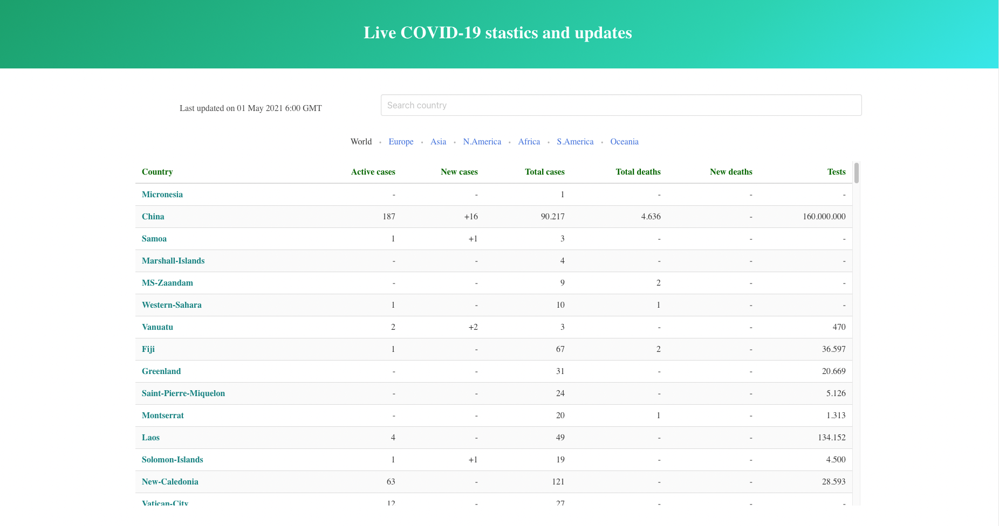
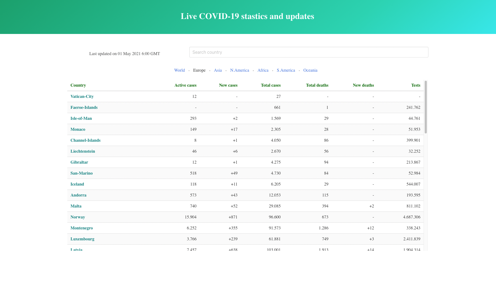
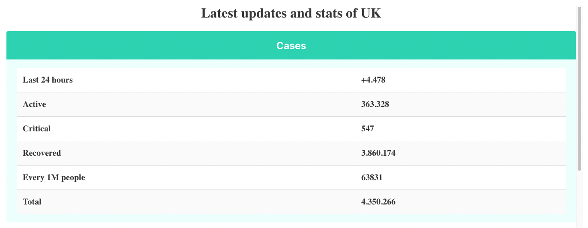
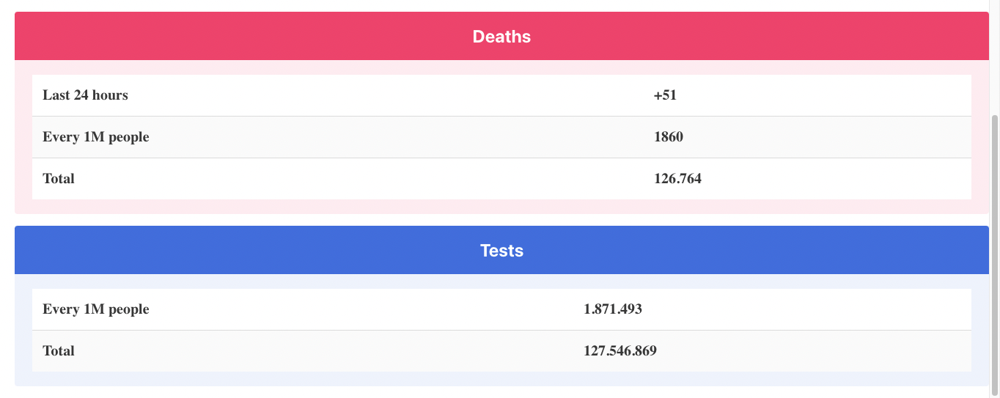

# Live covid-19 updates

An app that shows real time data about infections, lethality, tests and recovery of Covid19 worldwide

## Objective 

* To display data in real-time related to Covid19

* Show worldwide data or information related to countries of a specific continent

* Show the data of a specific country

## Skills and thechnical aspects to focus

* To build a React application
* Retrieve data from an API
* Display the data 
* Make the data sortable and searchable so is easy for the end user to find information

## Links

### [Web-page link](https://www.theodhorshyti.com/covid19/index.html)

